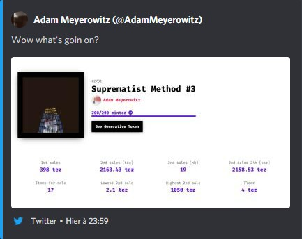

Report regarding the suspicious activity of Adam Meyerowitz
===================

*12/12/2021*

This document is a summary of the suspicious acitvity which happened around Adam Meyerowitz (*tz1PSNkFzJVBmSrmPaSbikkUc8vMiM4Z3GRC*) on fxhash.

* fxhash profile account: [https://fxhash.xyz/pkh/tz1PSNkFzJVBmSrmPaSbikkUc8vMiM4Z3GRC](https://fxhash.xyz/pkh/tz1PSNkFzJVBmSrmPaSbikkUc8vMiM4Z3GRC)

# Suspicious activity report

* ZK2w lists and instantly sells `Stripes - Winter Edition #28` [https://www.fxhash.xyz/objkt/97802](https://www.fxhash.xyz/objkt/97802) for 100 xtz to Asai_RyMi *tz1Mtmyq4Q4d4C9DgX9dfG6qFqYCuHSUc9TZ* A suspected copyminter. 100 xtz is the only sale of this piece.

* From **22:03:36 GMT** ZK2w started buying 'Suprematist Method #3' multiple times, resulting in a total of 41 purchases (#152 - 192)

* At **22:28:36 GMT**, it was brought to our attention that Adam Meyerowitz (tz1PSNkFzJVBmSrmPaSbikkUc8vMiM4Z3GRC) had sent 1,200 xtz to the account tz1RHRH92Zt3ruxJWwUuu6C7FsrgoVzSCJZj (Known herein as *CJZj). [Transaction](https://tzstats.com/op67LTpgp8TZTgzBwnBPsniiRvVoJ7sdK9fawAxCM8sixf6PqR4)

* At **22:33:36 GMT** CJZj made a purchase on the HEN marketplace for 1,100 xtz: [https://objkt.com/asset/hicetnunc/582864](https://objkt.com/asset/hicetnunc/582864). This purchase made by tz1SUPNYXG7e1Zjn1WPuUFfEFmLJY7KrwPDw (wPDw) is assumed to be a 'wash' purchase to transfer the xtz to another address, hiding within the transaction noise of the marketplace. 

* At **22:37:06 GMT** wPDw makes a purchase on the fxhash marketplace for 1050xtz for Adam Meyerowitz's 'Suprematist Method #3' #187 [https://www.fxhash.xyz/objkt/153318](https://www.fxhash.xyz/objkt/153318) from tz1gSs2PFWtUXA5BjGzfXW2xTGaSQTvyZK2w (ZK2w)

* At **22:59:00 GMT**, Adam expressed their surprise regarding the events happening on their work on the marketplace. The tweet has since be deleted (as many of their tweets), but here is a screen of the link preview still visible on discord:

* At **23:00:16** tz1f7zNRyNpBbNRx9xa4jW6XYgZdSYMH777n (already known to mods for copyminting) bought 'Suprematist Method #3' #175 from ZK2W for 1,050 xtz

* What follows is various changing of hands of 'Suprematist Method #3' over the market place between linked accounts for prices ranging between 30 xtz and 1,050 xtz

Charlie created a list of those transactions: [https://docs.google.com/spreadsheets/d/1I7wNv6a_uDJJ8udgQY74pWq_0Cr8NMr8Mlo5Ets8Kfk/edit#gid=1378423204](https://docs.google.com/spreadsheets/d/1I7wNv6a_uDJJ8udgQY74pWq_0Cr8NMr8Mlo5Ets8Kfk/edit#gid=1378423204)

We also discovered that Adam was trying to push Ordure's work ([profile](https://www.fxhash.xyz/pkh/tz1VE1gFxMZ5TVCwWaYpXGANcfhyjgiUGkpg)), a known copyminter, on twitter. You will find evidences of some of these tweets in the `./images` folders. We have reasons to believe that Adam and Ordure are related in a some way or the other (if not the same person).

More elements were discovered by the community, but this report won't go though all of them as it seems to us that this is enough to establish a judgement on the situation.

We reached out with Adam to try to clarify the situation before taking any public action, however their answer didn't clear any doubt we had on the situation. We will not disclose the conversation as it was private.

# Conclusion

We have enough evidences to believe that Adam tried to manipulate the marketplace by inflating the value of their work `Suprematist Method #3`. Through a series of transactions, Adam increased the volume of sales (both in number and xtz), trying to create artificial hype towards their project. Their tweet is a proof of their attempt. There is no way Adam could have transferred 1200 xtz to a random account which would have just a few minutes later bought their work, and so without knowing it. Moreover, subsequent transactions also demonstrate the same pattern.

We also investigated to see if the work produced by Adam was stolen somewhere, but we couldn't find anything.

We decided to flag `Suprematist Method #3` as `MALICIOUS` content since Adam was clearly manipulating its value to create some hype on the marketplace. We decided not to flag Adam account because their work doesn't seem to be stolen.

We will carefully monitor their work in the future.

# Be respectful

We can understand that the bahaviour Adam had with their work is not something we want within our community. However, please be respectful towards Adam as this could still be an isolated mistake they made, trying to game the system to earn some money.

Until their work was not found stolen, we will consider it to be original and won't take further actions.

# Contributors

The following members contributed to the findings and to this report:
* ashanke
* Xander Merricks
* BradML
* DaHawaiian
* qaulv
* Liam
* Charlie
* ciphrd 